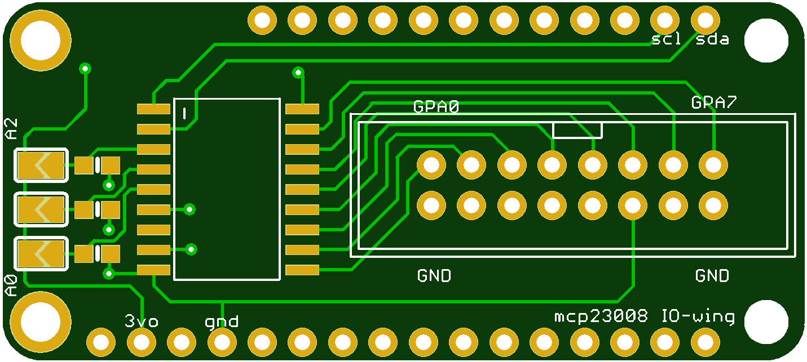
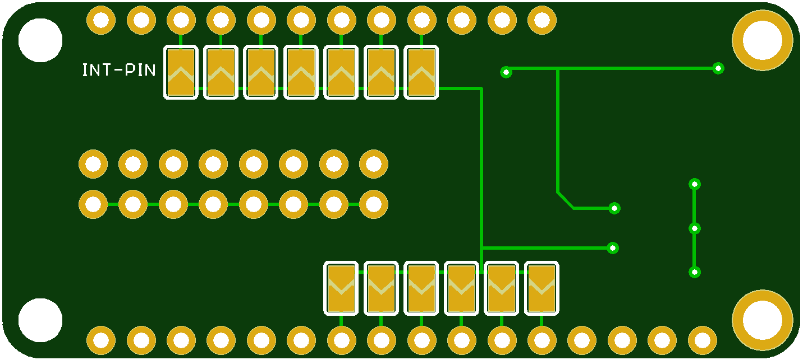

# MCP23008 io-wing

* IO expander wing for Adafruit Feather boards

Missing IO pins in your feather project? The MCP23008 I2C GPIO expander is great for situations like this. Add another 8 pins to your Feather using a MCP23008 port expander. The MCP23008 uses two i2c pins (these can be shared with other i2c devices), and in exchange gives you 8 general purpose pins. You can set each of 8 pins to be input, output, or input with a pullup. There's even the ability to get an interrupt via an external pin when any of the inputs change so you don't have to keep polling the chip.

You can sink/source up to 20mA from any of the I/O pins so this will work for LEDs and such. You can set the i2c address by tying the ADDR0-2 pins to power or ground by shorting solder jumpers, for up to 8 unique addresses. That means 8 chips can share a single i2c bus - that's 64 I/O pins for your Feather!

## Configure I2C adress

This wing uses I2C 7-bit address between 0x20-0x27, selectable with jumpers. On the left side of the wing there is 3 small solder jumpers labeled A0 - A2. By shorting out the solder jumper A0, A1, and A2 you can change the I2C address of the MCP23008.

| A2 | A1 | A0 | Address |
| --- | --- | --- | --- | 
| open | open | open | 0x20 |
| open | open | closed  | 0x21 |
| open | closed | open | 0x22 |
| open | closed | closed | 0x23 |
| closed | open | open | 0x24 |
| closed | open | closed  | 0x25 |
| closed | closed | open | 0x26 |
| closed | closed | closed | 0x27 |

## Using interrupts

To use the interrupt from the MCP23008 short one of the solder jumper on the backside of the wing to connect the interrupt pin from the MCP23008 to the corresponding pin on the Feather. 

